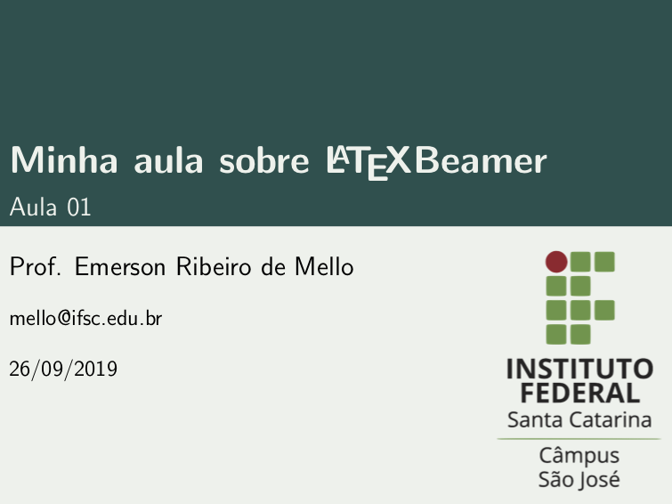

# Como organizar slides de aulas com LaTeX e git

ana


- Crie um subdiretório específico para cada aula. Esse diretório só terá o arquivo `.tex` e as figuras específicas para a aula em questão.
  - Quando fizer uma nova aula, use modelo o arquivo `.tex` de uma das aulas anteriores.
- O diretório `0-ifscyan-modelo` contém os arquivos `.sty` do modelo LaTeX Beamer, além das figuras de rodapé e logo da instituição. Dessa forma, esses arquivos não serão replicados em cada uma das aulas.

Abaixo é apresentada a estrutura proposta. No exemplo, tem-se duas aulas, cada qual em seu próprio diretório.

```
.
|-- 0-ifscyan-modelo
|   |-- beamercolorthemeifscyan.sty
|   |-- beamerthemeifscyan.sty
|   `-- figs
|       |-- ifsclogo.png
|       `-- rodape.png
|-- aula01
|   |-- aula01.tex
|   `-- figs
|       `-- git-branch.png
`-- aula02
    |-- aula02.tex
    `-- figs
```

## Fluxo de trabalho com o git

- Não misture, em um mesmo *commit*, alterações em diferentes aulas
- No final do semestre marque com uma *tag* o último *commit*. Por exemplo, `git tag 2019-02`. Isso permitirá recuperar o conjunto de aulas por semestre


## Exemplo do slide gerado com o modelo 


Abaixo um exemplo de slides gerado com o modelo presente nesse repositório.



## Configurações do Visual Studio Code

O Visual Studio Code possui a extensão [LaTeX Workshop](https://marketplace.visualstudio.com/items?itemName=James-Yu.latex-workshop) que o torna uma IDE LaTeX. Abaixo deixo algumas configurações pessoais que criei para facilitar a edição de slides LaTeX/Beamer com o Visual Studio Code.

Da forma que fiz, ao salvar um documento, o VSC automaticamente irá compilar e gerar o PDF. A visualização do PDF ficará no painel lateral (precisará clicar no ícone na parte superior da direita).

### User Snippets

- Abra o Visual Studio Code, vá em *Preferences* -> *User snippets* e edite o arquivo `latex.json`. Coloque o seguinte conteúdo dentro:

  - ```json
    {
    	"Beamer frame":{
    		"prefix": "frame",
    		"body": ["\\begin{frame}[wide]{$1}\n\\begin{itemize}\n\t\\item $2\n\\end{itemize}\n\\end{frame}"],
    		"description": "Frame para LaTeX Beamer"
    	},
    	"LaTeX itemize env":{
    		"prefix": "itemize",
    		"body": ["\\begin{itemize}\n\t\\item $1\n\\end{itemize}"],
    		"description": "itemize env para LaTeX"
    	},
    	"Beamer block":{
    		"prefix": "block",
    		"body": ["\\begin{block}{}\n\t $1\n\\end{block}"],
    		"description": "Block para LaTeX Beamer"
    	},
    	"LaTeX column env":{
    		"prefix": "columns",
    		"body": ["\\begin{columns}\n\t\\column{.5\\linewidth}\n\t $1\n\t\\column{.5\\linewidth}\n\t $2 \n\\end{columns} "],
    		"description": "columns env para LaTeX"
        },
        "LaTeX figure env":{
    		"prefix": "figure",
    		"body": ["\\begin{figure}[ht]\n\t\\centering\n\t\\includegraphics[width=${2:\\linewidth}]{figs/$1}\n\t\\caption{}\n\t\\label{fig:}\n\\end{figure}"],
    		"description": "LaTeX figure env"
        },
        "LaTeX includegraphics beamer":{
    		"prefix": "includegraphics",
    		"body": ["\\begin{center}\n\t\\includegraphics[width=${2:\\linewidth}]{figs/$1}\n\\end{center}"],
    		"description": "LaTeX includegraphics"
        },
        "LaTeX beamer only":{
    		"prefix": "only",
    		"body": ["\\only<${1|1,2,3,4,5,6|}>{\n\t${2}\n}"],
    		"description": "LaTeX beamer only"
        },
        "Beamer only env":{
    		"prefix": "onlyenv",
    		"body": ["\\begin{onlyenv}<${1|1,2,3,4,5,6|}>\n\t $2\n\\end{onlyenv}"],
    		"description": "Only env para LaTeX Beamer"
        },
        "Latex includecode listing":{
    		"prefix": "includecode",
    		"body": ["\\includecode{java}{codes/$1}"],
    		"description": "comand para lstinputlisting LaTeX"
    	},
        "Lstlisting":{
    		"prefix": "lstlisting",
    		"body": ["\\begin{lstlisting}\n${1}\n\\end{lstlisting}"],
    		"description": "lstlisting para LaTeX"
        }
    }
    ```

Esses `snippets` são atalhos para gerar comandos em LaTeX. Por exemplo, sempre que eu preciso criar um novo slide eu só digito `frame` e no popup que aparece eu escolho o `frame` e pressiono ENTER. Dessa forma o Visual Studio Code gera o seguinte bloco:

```latex
\begin{frame}[wide]{}
\begin{itemize}
    \item 
\end{itemize}
\end{frame}
```

### Settings

- Abra o Visual Studio Code, vá em *Preferences* -> *Settings*. Mude para o modo que visualiza o conteúdo do arquivo `settings.json` (basta clicar em ícone que fica na parte superior do lado direito).  

- Adicione o seguinte trecho dentro do bloco já existente (o bloco é delimitado por { e })

  - ```json
    "latex-workshop.view.pdf.zoom": "page-width",
        "latex-workshop.view.pdf.viewer": "tab",
        "files.exclude": {
            "*.bbl": true,
            "*.nav": true,
            "*.snm": true,
            "*.aux": true,
            "*.fls": true,
            "*.blg": true,
            "*.idx": true,
            "*.ind": true,
            "*.lof": true,
            "*.lot": true,
            "*.out": true,
            "*.acn": true,
            "*.acr": true,
            "*.alg": true,
            "*.glg": true,
            "*.glo": true,
            "*.gls": true,
            "*.ist": true,
            "*.log": true,
            "*.fdb_latexmk": true,
            "*.synctex*": true,
            "*.toc": true,
            "*.vrb": true
    }, 
    "latex-workshop.latex.outputDir": "./outlatexdir",
    "latex-workshop.latex.recipes": [
        {
            "name": "latexmk",
            "tools": [
                "latexmk"
            ]
        }
    ],
    "latex-workshop.latex.tools": [
        {
            "name": "latexmk",
            "command": "latexmk",
            "args": [
                "-synctex=1",
                "-interaction=nonstopmode",
                "-file-line-error",
                "-pdf",
                "-aux-directory=outlatexdir",
                "-output-directory=outlatexdir",
                "%DOC%"
            ]
        },
        {
            "name": "pdflatex",
            "command": "pdflatex",
            "args": [
                "-synctex=1",
                "-interaction=nonstopmode",
                "-file-line-error",
                "-aux-directory=outlatexdir",
                "-output-directory=outlatexdir",
                "%DOC%"
            ]
        }
    ],
    "latex-workshop.message.update.show": false,
    "latex-workshop.chktex.enabled": true,
    "latex-workshop.latex.autoClean.run": "onFailed",
    "latex-workshop.synctex.synctexjs.enabled": false,
    "latex-workshop.intellisense.package.enabled": true,
    "latex-workshop.latex.clean.subfolder.enabled": true,
    "latex-workshop.bind.enter.key": false
    ```

  

  Isso fará com que todos os arquivos auxiliares da compilação do `.tex` sejam colocados dentro de um subdiretório `outlatexdir`. O PDF resultando também será colocado dentro desse subdiretório.

  Issto também fará que arquivos auxilares não sejam listados no painel explorador de arquivos do Visual Studio Code.

### Teclas de atalho

Abaixo criei teclas de atalho para os comandos que deixam o texto em **negrito**, *itálico* e typewriter.

```json
// Place your key bindings in this file to overwrite the defaults
[
{
    "key": "crtl+b",
    "command": "editor.action.insertSnippet",
    "when": "editorTextFocus && editorLangId == latex",
    "args": {
        "snippet": "\\textbf{${TM_SELECTED_TEXT}}$0"
    }
},
{
    "key": "crtl+i",
    "command": "editor.action.insertSnippet",
    "when": "editorTextFocus && editorLangId == latex",  // chained clause
    "args": {
        "snippet": "\\textit{${TM_SELECTED_TEXT}}$0"
    }
},
{
    "key": "crtl+t",
    "command": "editor.action.insertSnippet",
    "when": "editorTextFocus && editorLangId == latex",  // chained clause
    "args": {
        "snippet": "\\texttt{${TM_SELECTED_TEXT}}$0"
    }
}
]
```
